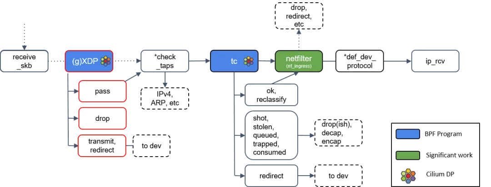

# dae 的工作原理

dae 通过 [eBPF](https://en.wikipedia.org/wiki/EBPF)  在 Linux 内核的 tc (traffic control) 挂载点加载一个程序，通过该程序在流量进入 TCP/IP 网络栈之前进行流量分流。tc 在 linux 网络协议栈中的位置见下图所示（图为收包路径，发包路径方向相反），其中 netfilter 是 iptables/nftables 的位置。

## 分流原理

### 分流信息

dae 支持以域名、源 IP、目的 IP、源端口、目的端口、TCP/UDP、IPv4/IPv6、进程名、MAC 地址等对流量进行分流。

其中，源 IP、目的 IP、源端口、目的端口、TCP/UDP、IPv4/IPv6、MAC 地址均可解析 MACv2 帧而得到。

**进程名**通过在 cgroupv2 挂载点侦听本地进程的 socket、connect、sendmsg 系统调用，并读取和解析进程控制块中的命令行来得到的。这种方式会比 clash 等用户态程序对传入的 socket 扫描整个 procfs 来得到进程信息要快得多（后者甚至是 10ms 级的）。

**域名**通过劫持 DNS 请求，将 DNS 请求的域名与所查 IP 进行关联来得到。尽管这种方式有一些问题：

1. 可能会出现误判。例如需要分流到国内和国外的两个网站拥有同一个 IP，且在短时间内同时被访问，或浏览器有 DNS 缓存。
2. 用户的 DNS 请求必须通过 dae。例如将 dae 设为 DNS，或在 dae 作为网关的情况下使用公共 DNS。

但相比其他方案，这种方案已经是较优解了。例如 Fake IP 方案存在无法通过 IP 分流且存在严重的缓存污染问题，而域名嗅探方案存在只能嗅探 TLS/HTTP 等流量的问题。实际上，通过 SNI 嗅探来进行分流确实是更优选择，但由于 eBPF 对程序复杂度的限制，以及对循环的支持不友好，我们无法在内核空间实现域名嗅探。

因此，当 DNS 请求无法通过 dae 时，基于 domain 的分流将会失效。

> 为了降低 DNS 污染，以及获得更好的 CDN 连接速度，dae 在用户空间实现了域名嗅探。在 `dial_mode` 为 domain 或 domain 的变体，且流量需要被代理时，将嗅探的 domain 发送给代理服务器，而不是发送 IP，这样在代理服务器侧会对域名重新进行解析并使用最优 IP 进行连接，从而解决了 DNS 污染的问题，并获得了更好的 CDN 连接速度。
>
> 同时，当高级用户已经使用了其他的分流方案，且不希望将 DNS 请求通过 dae，但希望被代理的那部分流量可以基于域名进行分流（例如基于目标域名，一部分分流到奈飞节点，一部分分流到下载节点，当然，也可以一部分通过 core 直连），可以通过 `dial_mode: domain++` 来强制使用嗅探的域名重新分流。

dae 会通过在 tc 挂载点的程序将流量分流，根据分流结果决定重定向到 dae 的 tproxy 端口或放其直连。

### 代理原理

dae 的代理原理和其他程序近似。区别是在绑定 LAN 接口时， dae 通过 eBPF 将 tc 挂载点的需代理流量的 socket buffer 直接关联至 dae 的 tproxy 侦听端口的 socket；在绑定 WAN 接口时，dae 将需代理流量 socket buffer 从网卡出队列移动至网卡的入队列，禁用其 checksum，并修改目的地址为 tproxy 侦听端口。

以 benchmark 来看，dae 的代理性能比其他代理程序好一些，但不多。

### 直连原理

一直以来，为了分流，流量需要经过代理程序，经过分流模块之后，再决定是直连还是代理。这样流量需要经过网络栈的解析、处理、拷贝，传入代理程序，再通过网络栈拷贝、处理、封装，然后传出，消耗大量资源。特别是对于 BT 下载等场景，尽管设置了直连，仍然会占用大量连接数、端口、内存、CPU 资源。甚至对于游戏的场景，会由于代理程序的处理不当而影响 NAT 类型，导致连接出错。

dae 在内核的较早路径上就对流量进行了分流，直连流量将直接进行三层路由转发，节省了大量内核态到用户态的切换和拷贝开销，此时 Linux 相当于一个纯粹的交换机或路由器。

> 为了让直连生效，对于高级拓扑的用户，请确保按 [kernel-parameters](getting-started/kernel-parameters.md) 配置后，在**关闭** dae 的情况下，其他设备将 dae 所在设备设为网关时，网络是畅通的。例如访问 223.5.5.5 能够得到“UrlPathError”的响应，且在 dae 所在设备进行 tcpdump 可以看到客户端设备的请求报文。

因此，对于直连流量，dae 不会进行 SNAT，对于“旁路由”用户，这将形成非对称路由，即客户端设备发包时流量通过 dae 设备发送到网关，收包时由网关直接发给客户端设备，绕过 dae 设备。

> 这里的旁路由定义为：1，被设为网关。2，对 TCP/UDP 进行 SNAT。3，与上级网关和下游设备属于同一个网段和链路。
> 
> 例如笔记本电脑在 192.168.0.3，旁路由在 192.168.0.2，路由器在 192.168.0.1。三层逻辑拓扑为：笔记本电脑 -> 旁路由 -> 路由器，且在路由器一侧只能看到源 IP 是 192.168.0.2 的 TCP/UDP 流量，而没有 192.168.0.3 的 TCP/UDP 流量。
> 
> 据目前所知，我们是第一个对旁路由进行定义的（笑）。

非对称路由将带来一个优点和一个可能的问题：

1. 会带来性能提升。由于回包不经过 dae，减少了路径，直连性能将变得和没有旁路由一样快。
2. 会导致高级防火墙的状态维护失效从而丢包（例如 Sophos Firewall）。这一问题在家用网络中一般不会出现。

以 benchmark 来看，dae 的直连性能和其他代理程序相比就像个怪物。
